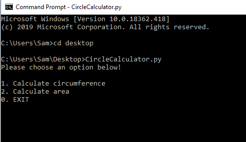
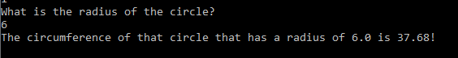
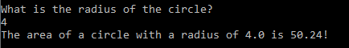

# Circle
## Python Circle Calculator
#### Purpose
This program was created to calculate the circumference and area of a circle when given the radius. I created this in a python class and I would consider myself a beginner when it comes to coding. 
#### Description
This program was created using a while loop, print statements, and conditional statements to achieve its main purpose. First a menu was created using various print statements so the program would be more user-friendly. When this program is ran using the command prompt, the user should be presented with something like shown in the image provided below.

The user can then choose whether they want to calculate the circumference or area of the circle. The code asks for input and compares the input to the conditional statements. So, IF they input an option choice it compares that input in the conditional statement and runs the code accordingly to what it matches. If the user inputs "1" it will run the code to calculate the circumference. If they enter "2" it will run the code to calculate the area. If the user decides they do not want to use the program they will enter "0" which will then terminate the code completely. 

###### Circumference

When the user picks option 1 the program will ask for the user to input the radius of the given circle and it will then multiply that value times pi and then by 2. Then the program stores that value into a variable so that it can be printed out and the user can see the end value.

###### Area

When the user picks option 2 the program will ask the user to input the radius of the given circle and it will multiply that value times itself and then by pi. Then the program stores that value into a variable so that it can be printed out and the user can see the end value.

###### EXIT 
When the user chooses this option the program terminates, or in other words, closes.
